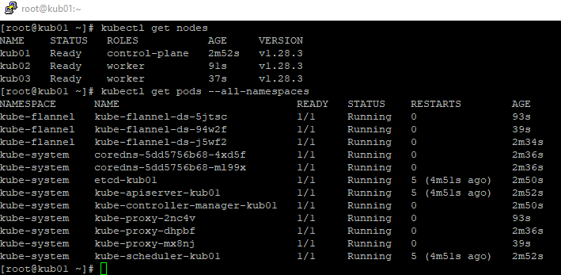
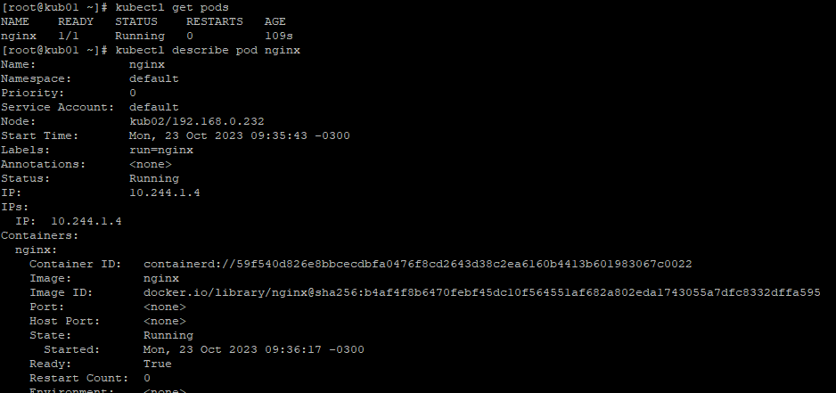

# Kubernetes Cluster
Guide with step by step to deploy a new Kubernetes Cluster and test it.
Its important to know that this guide is based on official references: 
https://kubernetes.io/docs/setup/production-environment/tools/kubeadm

Principal reference: https://kubernetes.io/docs/setup/production-environment/tools/kubeadm/create-cluster-kubeadm/

## Architecture

### Steps

#### Hosts file
Because I didnt setup DNS services I configured /etc/hosts identically on each node.

```bash
192.168.0.231   kub01
192.168.0.232   kub02
192.168.0.233   kub03
```

#### SSH
In each node its recommended to have passwordless communication between the nodes.
Run this commands to grant ssh access between the nodes:

```bash
ssh-keygen
ssh-copy-id $node
```

#### SWAP OFF
```bash
sudo swapoff -a
sed -i -e 's/.*swap/#&/' /etc/fstab
mount -a
```

#### Ports Available
nc 127.0.0.1 6443

 wget https://download.docker.com/linux/centos/docker-ce.repo
 cp docker-ce.repo /etc/yum.repos.d/
yum repolist

yum install containerd -y
systemctl enable containerd
systemctl start containerd


sed -i 's/^SELINUX=enforcing$/SELINUX=disabled/' /etc/selinux/config
reboot

- Add repo for k8s
```bash
cat <<EOF | sudo tee /etc/yum.repos.d/kubernetes.repo
[kubernetes]
name=Kubernetes
baseurl=https://pkgs.k8s.io/core:/stable:/v1.28/rpm/
enabled=1
gpgcheck=1
gpgkey=https://pkgs.k8s.io/core:/stable:/v1.28/rpm/repodata/repomd.xml.key
exclude=kubelet kubeadm kubectl cri-tools kubernetes-cni
EOF
```
```bash
yum install -y kubelet kubeadm kubectl --disableexcludes=kubernetes
systemctl enable kubelet

firewall-cmd --permanent --add-port=8001/tcp
firewall-cmd --permanent --add-port=8080/tcp
firewall-cmd --permanent --add-port=6443/tcp
firewall-cmd --permanent --add-port=2379-2380/tcp
firewall-cmd --permanent --add-port=10248/tcp
firewall-cmd --permanent --add-port=10250/tcp
firewall-cmd --permanent --add-port=10251/tcp
firewall-cmd --permanent --add-port=10252/tcp

firewall-cmd --reload
firewall-cmd --list-ports

sudo modprobe overlay
sudo modprobe br_netfilter

cat <<EOF | sudo tee /etc/modules-load.d/containerd.conf
overlay
br_netfilter
EOF

cat <<EOF | sudo tee /etc/sysctl.d/99-kubernetes-cri.conf
net.bridge.bridge-nf-call-iptables = 1
net.ipv4.ip_forward = 1
net.bridge.bridge-nf-call-ip6tables = 1
EOF

sysctl -p
```


- Change /etc/containerd/config.toml from disabled_plugin to enabled_plugin and save the file:
```bash
sed -i 's/disabled_plugins/enabled_plugins/g' /etc/containerd/config.toml
```

- Restart service containerd: 
```bash
systemctl restart containerd
```

- Init Cluster
```bash
kubeadm init --pod-network-cidr=10.244.0.0/16
```
*Expected results are: 
Your Kubernetes control-plane has initialized successfully!

export KUBECONFIG=/etc/kubernetes/admin.conf

```bash
kubectl apply -f https://github.com/flannel-io/flannel/releases/latest/download/kube-flannel.yml
```

- Join nodes to the cluster
kubeadm join kub01:6443 --token cd8k4h.h17ovxru3y6z3kbw \
        --discovery-token-ca-cert-hash sha256:f737d7b9d3caadbd7c9bf8358a9e8a335078acad03f6d1fc639599014e7258b2

More information about joining nodes to the cluster: https://kubernetes.io/docs/setup/production-environment/tools/kubeadm/create-cluster-kubeadm/#join-nodes

kubectl label node kub02 node-role.kubernetes.io/worker=worker
kubectl label node kub03 node-role.kubernetes.io/worker=worker



Cluster Ready!

#### Graphic interface
The Dashboard UI is not deployed by default. To deploy it, run the following command:

```bash
kubectl apply -f https://raw.githubusercontent.com/kubernetes/dashboard/v2.7.0/aio/deploy/recommended.yaml
```

#### First pod
Once you’re in the Kubernetes sandbox environment, make sure you’re connected to the Kubernetes cluster by executing kubectl get nodes in the command line to see the cluster's nodes in the terminal. If that worked, you’re ready to create and run a pod.

```bash
kubectl run nginx --image=nginx --restart=Never
```

Once you hit enter, the pod will be created. You should see pod/nginx created appear in the terminal.
You can now run the command kubectl get pods to see the status of your pod. To view the entire configuration of the pod, just run kubectl describe pod nginxin your terminal.

```bash
kubectl get pods
 kubectl describe pod nginx
```



Its running on worker kub02.


